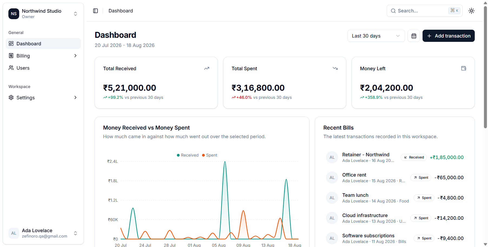
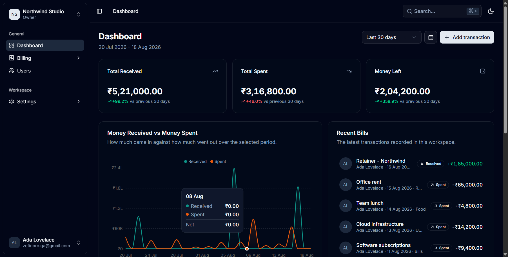
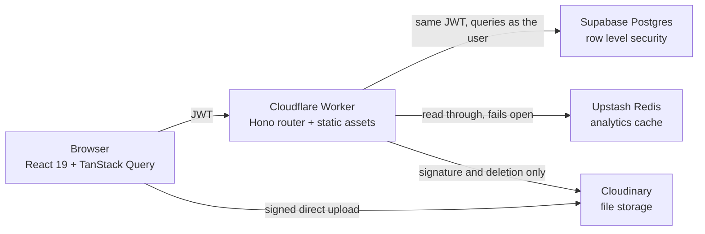
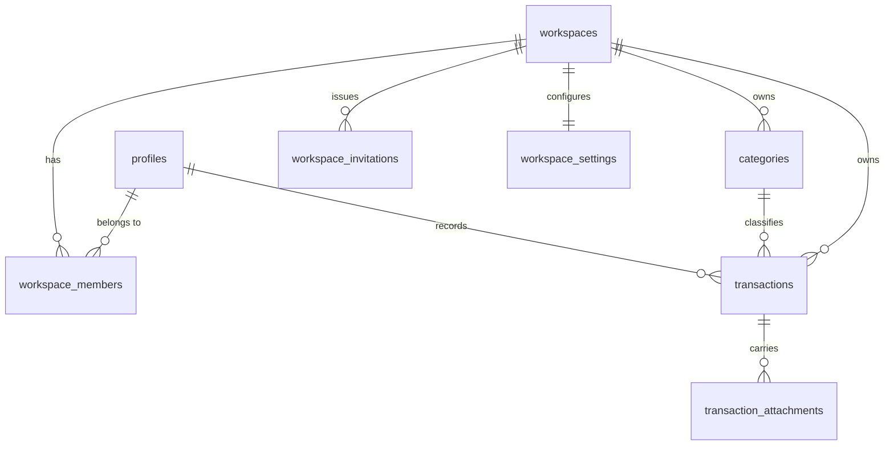
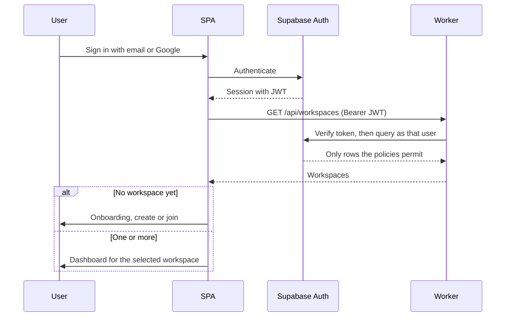
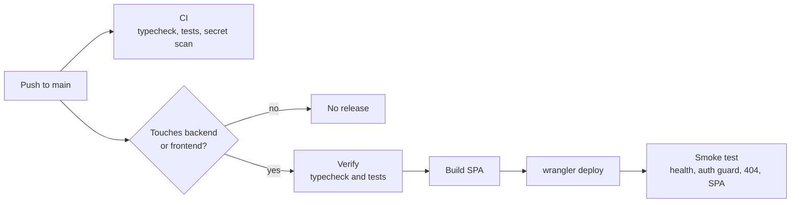

<div align="center">


<h1>Zefinoro</h1>

<p><strong>Multi-tenant financial tracking for teams, on the edge.</strong></p>

<p>
Track what comes in, what goes out and what is left, across as many workspaces as you belong to.
Built as a real product rather than a dashboard demo: row-level security is the authorization
boundary, totals are computed in Postgres, and the whole thing runs from a single Cloudflare Worker.
</p>

<p>
<a href="https://github.com/spacesdrive/zefinoro/blob/main/LICENSE"></a>
<a href="https://github.com/spacesdrive/zefinoro/actions/workflows/ci.yml"></a>
<a href="https://github.com/spacesdrive/zefinoro/actions/workflows/deploy.yml"></a>

<a href="https://developers.cloudflare.com/workers/"></a>
</p>

<p>
<a href="#quick-start">Quick start</a> &nbsp;&middot;&nbsp;
<a href="#architecture">Architecture</a> &nbsp;&middot;&nbsp;
<a href="#security-model">Security model</a> &nbsp;&middot;&nbsp;
<a href="#api-reference">API</a> &nbsp;&middot;&nbsp;
<a href="#deployment">Deployment</a>
</p>

</div>

<div align="center">
  
  
</div>

---

## Why this exists

Most personal finance tools assume one person and one ledger. The moment a second person is
involved, a studio tracking client retainers or a household splitting bills, you are back to a
spreadsheet nobody trusts.

Zefinoro treats the workspace as the unit. A user belongs to many workspaces, each with its own
ledger, members, categories, invitations and files. The hard part of that is not the UI, it is
making certain that workspace A can never see workspace B, including when a controller has a bug.
This project puts that guarantee in the database rather than in application code.

## Features

| Capability | What it does |
| --- | --- |
| Multi-workspace | Belong to many workspaces, switch instantly, no data bleeds between them |
| Role-based access | Owner, admin and member, enforced in Postgres policies rather than in the UI |
| Invitations | Cryptographically generated codes with expiry, use limits, revocation and audit trail |
| Transaction ledger | Received and spent entries with title, description, amount, currency, category and date |
| File attachments | Images, PDFs, video, audio, documents and archives, uploaded straight to storage |
| In-browser previews | Type-aware viewers for images, PDFs, video, audio, text, CSV and JSON |
| Dashboard analytics | Server-computed totals with period-over-period deltas and interactive charts |
| Billing workspace | Sortable, filterable and paginated table with searching and column visibility |
| Command palette | Keyboard-first navigation and actions on `Ctrl` or `Cmd` + `K` |
| Light and dark themes | Design tokens throughout, no hard-coded colours |
| Google and email auth | Supabase Auth, with identity linking so both methods reach one account |

## Quick start

Requires [Node.js 22 or newer](https://nodejs.org), a [Supabase project](https://supabase.com) and a
[Cloudinary account](https://cloudinary.com).

```bash
git clone https://github.com/spacesdrive/zefinoro.git
cd zefinoro
npm run install:all

cp .env.example frontend/.env      # VITE_SUPABASE_URL, VITE_SUPABASE_ANON_KEY
cp .env.example backend/.dev.vars  # server-side values

npx supabase link --project-ref <your-project-ref>
npx supabase db push               # tables, indexes, RLS policies, RPCs, seed categories
```

Then start both processes:

```bash
npm run dev:api    # Worker on http://localhost:8787
npm run dev:web    # SPA on http://localhost:5173, proxying /api to the Worker
```

Sign up, create a workspace, and record a transaction. Full variable documentation is in
[`.env.example`](.env.example).

## Architecture

One Cloudflare Worker serves both the JSON API and the compiled single-page app, so the browser
talks to a single origin and CORS never enters the picture.



Two decisions shape everything else.

**The Worker holds no service-role key.** It forwards the caller's JWT to Supabase, so every query
runs as that user and row-level security applies exactly as it would to a direct connection. A
mistake in a controller cannot read another tenant's ledger, because the database refuses.

**Files never pass through the Worker.** A 25 MiB video has no business occupying Worker memory.
The browser requests a short-lived signature, uploads directly to Cloudinary, and returns the
resulting metadata for the API to validate and record.

### Repository layout

```
zefinoro/
├── backend/                  Hono API on Cloudflare Workers
│   └── src/
│       ├── index.ts          Worker entry: API under /api, SPA everywhere else
│       ├── routes/           Route table and middleware composition
│       ├── controllers/      One module per resource
│       ├── middleware/       auth, workspace authorization, validation, rate limiting
│       ├── lib/              supabase, redis, cloudinary, files, dates, errors
│       ├── schemas/          Zod request contracts
│       └── types/            Worker bindings and database row types
├── frontend/                 React single-page application
│   └── src/
│       ├── app/              Shell, router, query client
│       ├── routes/           Page components
│       ├── components/       ui, layout, dashboard, billing, files, users
│       ├── features/         Per-domain API clients and query hooks
│       ├── contexts/         auth, workspace, theme
│       └── schemas/          Zod form contracts
└── supabase/migrations/      Schema, RLS policies, RPCs
```

## Data model

Eight tables. Membership is a row rather than a column, which is what makes roles extensible and
lets a single user hold different roles in different workspaces.



Amounts are stored as `numeric` with a separate `currency` column, never as a formatted string, so
arithmetic stays exact and the display layer is free to change. Indexes cover the access patterns
the dashboard actually uses: by workspace, type, transaction date and category.

## Security model

| Control | Implementation |
| --- | --- |
| Tenant isolation | Row-level security on every table, with `SECURITY DEFINER` membership helpers that avoid policy recursion |
| Workspace resolution | The identifier in a URL is resolved to a verified membership before any controller runs |
| Non-member response | `404` rather than `403`, because confirming a workspace exists is itself a disclosure |
| Invite codes | Generated in Postgres via `gen_random_bytes`, from an alphabet without ambiguous characters |
| Redemption races | Redeemed inside a locked transaction, so a single-use code cannot be consumed twice |
| Last owner | A trigger prevents a workspace from losing its final owner |
| Upload validation | Extension, MIME type and size are re-checked server-side, and mismatches are rejected |
| Storage allow-listing | Attachment URLs that do not belong to the configured cloud are refused before storage |
| Rate limiting | Invite creation and preview, workspace creation and upload signing |
| Bundle contents | Only the Supabase URL and anon key reach the browser, both safe to publish |

### Authentication flow



## API reference

All endpoints live under `/api`. Everything below `/workspaces/:workspaceId` passes through
authorization middleware first, so a new endpoint is protected by construction.

| Method | Path | Purpose |
| --- | --- | --- |
| `GET` | `/health` | Liveness probe, the only public route |
| `GET` `PATCH` | `/me` | Read and update the signed-in profile |
| `GET` `POST` | `/workspaces` | List memberships, create a workspace |
| `POST` | `/workspaces/join` | Redeem an invitation code |
| `GET` | `/invitations/preview` | Validate a code without consuming it, rate limited |
| `GET` `PATCH` `DELETE` | `/workspaces/:id` | Read, update, delete a workspace |
| `POST` | `/workspaces/:id/leave` | Leave, unless you are the last owner |
| `GET` `PATCH` | `/workspaces/:id/settings` | Workspace preferences |
| `GET` | `/workspaces/:id/stats` | Totals with period-over-period deltas |
| `GET` | `/workspaces/:id/series` | Received against spent, bucketed over time |
| `GET` | `/workspaces/:id/breakdown` | Totals grouped by category |
| `GET` | `/workspaces/:id/recent` | Latest transactions |
| `GET` `POST` | `/workspaces/:id/transactions` | List with filters, create |
| `GET` `PATCH` `DELETE` | `/workspaces/:id/transactions/:txId` | Single transaction |
| `POST` | `/workspaces/:id/uploads/sign` | Short-lived upload signature |
| `GET` `POST` | `/workspaces/:id/transactions/:txId/attachments` | List and attach files |
| `DELETE` | `/workspaces/:id/attachments/:attachmentId` | Remove a file and its stored asset |
| `GET` `POST` | `/workspaces/:id/categories` | List and create categories |
| `PATCH` `DELETE` | `/workspaces/:id/categories/:categoryId` | Manage a category |
| `GET` | `/workspaces/:id/members` | List members |
| `PATCH` `DELETE` | `/workspaces/:id/members/:memberId` | Change role, remove member |
| `GET` `POST` | `/workspaces/:id/invitations` | List and create invitations |
| `POST` | `/workspaces/:id/invitations/:inviteId/revoke` | Stop a live code working |
| `DELETE` | `/workspaces/:id/invitations/:inviteId` | Delete the invitation record |

Responses are enveloped as `{ "data": ... }`, and failures as
`{ "error": { "code", "message", "requestId" } }` with a stable machine-readable code.

## Tech stack

| Layer | Choice | Reasoning |
| --- | --- | --- |
| API | [Hono](https://hono.dev) on [Cloudflare Workers](https://developers.cloudflare.com/workers/) | One Worker serves API and SPA from a single origin |
| Database | [Supabase Postgres](https://supabase.com/docs/guides/database) | Row-level security is a real authorization boundary |
| Cache | [Upstash Redis](https://upstash.com/docs/redis/overall/getstarted) | Analytics cache only, Postgres stays authoritative |
| Storage | [Cloudinary](https://cloudinary.com/documentation) | Direct browser uploads with server-signed policies |
| UI | [React 19](https://react.dev), [Vite](https://vite.dev), [Tailwind CSS v4](https://tailwindcss.com) | Strict types, fast builds, route-level code splitting |
| Components | [shadcn/ui](https://ui.shadcn.com) on [Radix](https://www.radix-ui.com) | Accessible primitives rather than reinvented ones |
| Server state | [TanStack Query](https://tanstack.com/query/latest) | Workspace-scoped cache keys prevent cross-tenant bleed |
| Forms | [React Hook Form](https://react-hook-form.com) with [Zod](https://zod.dev) | The same schemas back client and server validation |
| Charts | [Recharts](https://recharts.org) | Theme-aware and accessible |

## Engineering notes

**Money is never optimistic.** Preferences and toggles update optimistically. Creating or deleting a
transaction waits for the server, because a row that appears in a ledger and then vanishes is worse
than a brief spinner.

**Totals are computed in Postgres.** The client sends a period, never a figure. The `dashboard_stats`
function returns both the requested window and the preceding window of equal length, so
period-over-period deltas are server-derived too.

**"Today" belongs to the user, not to UTC.** Relative ranges resolve against the caller's local date.
Without that, someone in IST recording a transaction just after midnight would find it excluded from
"last 30 days", because the server's day had not rolled over yet.

**Cache invalidation by version bump.** Upstash has no cheap wildcard delete, so every analytics key
embeds a per-workspace counter. A mutation increments the counter and orphans that whole generation
at once, and the orphans expire on their own TTL. Every Redis call fails open, because a cache
outage must not take the ledger down with it.

**Chart colours were validated, not chosen by eye.** Received against spent is a two-slot categorical
encoding. The obvious green and red pairing failed colourblind separation under deuteranopia,
precisely the pair a significant share of men cannot resolve, on a chart whose entire job is showing
money in against money out. Teal and orange clear the check against both light and dark surfaces,
and identity never rests on colour alone, since both charts carry a legend and a naming tooltip.

## Testing

```bash
npm test          # both packages
npm run typecheck # strict TypeScript across both
```

Coverage targets the logic that is easy to get quietly wrong: inclusive date windows, leap years,
the timezone anchor, two-decimal money handling, the extension against MIME cross-check that stops a
renamed executable, and the storage URL construction that has already broken downloads once.

## Deployment

Two [GitHub Actions](https://docs.github.com/en/actions) workflows drive releases.



[`ci.yml`](.github/workflows/ci.yml) runs on every push and pull request.
[`deploy.yml`](.github/workflows/deploy.yml) runs only when application code changes, so a
documentation commit never ships a release.

Four repository secrets are required under **Settings, Secrets and variables, Actions**:

| Secret | Purpose |
| --- | --- |
| `CLOUDFLARE_API_TOKEN` | Deploy the Worker |
| `CLOUDFLARE_ACCOUNT_ID` | Target account |
| `VITE_SUPABASE_URL` | Inlined into the bundle at build time |
| `VITE_SUPABASE_ANON_KEY` | Inlined into the bundle at build time |

Server-side secrets are deliberately not passed through CI. They are set once with
`wrangler secret bulk` and persist across deployments, so the pipeline never sees them.

To deploy by hand:

```bash
npm run build
npm run deploy
```

### Provider configuration

A few settings live in provider consoles rather than in this repository.

- **Supabase Auth.** Set the site URL and redirect allow list to your deployed origin. For Google
  sign-in, enable the provider and register
  `https://<project-ref>.supabase.co/auth/v1/callback` with your
  [Google OAuth client](https://console.cloud.google.com/apis/credentials). Identity linking
  requires manual linking to be enabled.
- **Cloudinary.** PDF and ZIP delivery is disabled by default on new accounts as an anti-abuse
  measure, and every such URL returns `401` until it is enabled under Settings, Security. If Strict
  Transformations is enabled, set `CLOUDINARY_ENABLE_TRANSFORMS=false` so the app serves plain
  delivery URLs instead of derived ones.

## Contributing

Contributions are welcome. Open an issue to discuss anything substantial before writing code.

1. Fork the repository and create a branch from `main`.
2. Run `npm run install:all`, then `npm test` and `npm run typecheck` before opening a pull request.
3. Keep commits focused, and explain the reasoning in the commit body rather than only the change.

The CI workflow runs the same checks, so a green local run usually means a green pull request.

## License

Released under the [MIT License](LICENSE).

The interface is adapted from [shadcn-admin](https://github.com/satnaing/shadcn-admin) by Sat Naing
and builds on [shadcn/ui](https://ui.shadcn.com), both MIT licensed.
